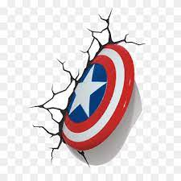

  

    
  

  
  ## Hello, Everyone! :wave:
  
  

    <b>New Flatiron Software Engineer graduate</b> with 6+ years experience as a Business Leader/Manager enhancing the customer experience, uniting organizational best practices, problem solving and improving business operations. Even with the "new" next to the engineer title, development was never foreign to me in the workplace.
  

  
## Table of Contents

- [Current Projects](#current_projects)
- [How to Contact Me](#how_to_contact_me)
- [Currently Learning](#currently_learning)
- [Fun Facts](#fun_facts)

## Current Projects

Project 5: Weather Watcher

Project 4: Cookbook

Project 3: Inventory Tracker

Project 2: Customer Tracker

Project 1 Movie Lister

## How to Contact Me
   ### Social Media
   
  

    
    
  

    
  ### Blog
  
  

    
  

   
  ### Email Me
  
  

    
  

  
## Currently Learning

- ### AWS 
- ### POSTGRESQL 

## Fun Facts

- I am a huge Marvel fan! I think I have every super hereo t-shirt in my closet. #FirstAvenger 

[back to top](#table-of-contents)
  

<!--
**noahaklem/noahaklem** is a ✨ _special_ ✨ repository because its `README.md` (this file) appears on your GitHub profile.

Here are some ideas to get you started:

- 🔭 I’m currently working on ...
- 🌱 I’m currently learning ...
- 👯 I’m looking to collaborate on ...
- 🤔 I’m looking for help with ...
- 💬 Ask me about ...
- 📫 How to reach me: ...
- 😄 Pronouns: ...
- ⚡ Fun fact: ...
-->
